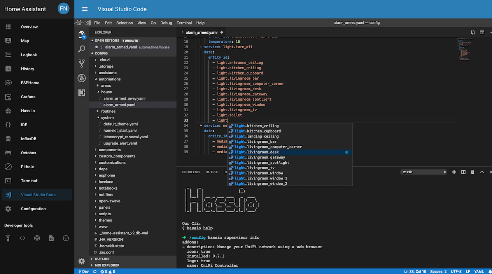

# Home Assistant Community Add-on: Visual Studio Code

[![GitHub Release][releases-shield]][releases]
![Project Stage][project-stage-shield]
[![License][license-shield]](LICENSE.md)

![Supports aarch64 Architecture][aarch64-shield]
![Supports amd64 Architecture][amd64-shield]
![Supports armhf Architecture][armhf-shield]
![Supports armv7 Architecture][armv7-shield]
![Supports i386 Architecture][i386-shield]

[![GitLab CI][gitlabci-shield]][gitlabci]
![Project Maintenance][maintenance-shield]
[![GitHub Activity][commits-shield]][commits]

[![Discord][discord-shield]][discord]
[![Community Forum][forum-shield]][forum]

[![Sponsor Frenck via GitHub Sponsors][github-sponsors-shield]][github-sponsors]

[![Support Frenck on Patreon][patreon-shield]][patreon]

Visual Studio Code, accessible through the browser.

## About

This add-on runs Visual Studio Code, allowing you to edit your Home Assistant
configuration directly from your web browser and can be embedded straight
into the Home Assistant frontend UI.

Visual Studio Code runs as a remote server using `code-server`, and is a
fully fledged VSCode experience.

The add-on has the Home Assistant, MDI icons and YAML extensions pre-installed
and pre-configured right out of the box. This means that auto-completion works
instantly, without the need for configuring anything.



## Installation

The installation of this add-on is pretty straightforward and not different in
comparison to installing any other Home Assistant add-on.

1. Search for the "Visual Studio Code" add-on in the Supervisor add-on store
   and install it.
1. Start the "Visual Studio Code" add-on.
1. Check the logs of the "Visual Studio Code" add-on to see if everything went
   well.
1. Click the "OPEN WEB UI" button to open Visual Studio Code.

## Configuration

**Note**: _Remember to restart the add-on when the configuration is changed._

Example add-on configuration:

```yaml
log_level: info
packages:
  - mariadb-client
init_commands:
  - ls -la
disable_telemetry: false
```

**Note**: _This is just an example, don't copy and paste it! Create your own!_

### Option: `log_level`

The `log_level` option controls the level of log output by the addon and can
be changed to be more or less verbose, which might be useful when you are
dealing with an unknown issue. Possible values are:

- `trace`: Show every detail, like all called internal functions.
- `debug`: Shows detailed debug information.
- `info`: Normal (usually) interesting events.
- `warning`: Exceptional occurrences that are not errors.
- `error`:  Runtime errors that do not require immediate action.
- `fatal`: Something went terribly wrong. Add-on becomes unusable.

Please note that each level automatically includes log messages from a
more severe level, e.g., `debug` also shows `info` messages. By default,
the `log_level` is set to `info`, which is the recommended setting unless
you are troubleshooting.

### Option: `packages`

Allows you to specify additional [Ubuntu packages][ubuntu-packages] to be
installed in your shell environment (e.g., Python, PHP, Go).

**Note**: _Adding many packages will result in a longer start-up
time for the add-on._

### Option: `init_commands`

Customize your VSCode environment even more with the `init_commands` option.
Add one or more shell commands to the list, and they will be executed every
single time this add-on starts.

### Option: `disable_telemetry`

Disables anonymous usage telemetry data from being sent to code-server.

## Resetting your VSCode settings to the add-on defaults

The add-on updates your settings to be optimized for use with Home Assistant.
As soon as you change a setting, the add-on will stop doing that since it
might be destructive. However, in case you changed some things, but want to
return to the defaults as delivered by this add-on, do the following:

1. Open the Visual Studio Code editor.
1. Click on `Terminal` in the top menu bar and clik on `New Terminal`.
1. Execute the following command in the terminal window: `reset-settings`.
1. Done!

## Using with ESPHome

The add-on has support for ESPHome (and its vscode extension), built-in!
It has been installed and pre-configured for you, however, it might need
an adjustment to your ESPHome add-on in order to function.

1. Go to the ESPHome add-on configuration in your Supervisor panel.
1. Add the `leave_front_door_open` option, since the vscode extension of
   ESPHome does not support authentication yet. The ESPHome add-on
   configuration would look like this:

   ```yaml
   leave_front_door_open: true
   ```

1. Save the add-on configuration.
1. Enable direct access to the ESPHome add-on, by enabling the network port.
   This option can be found on the ESPHome add-on settings page, in the
   "Network" section. In the "Host" field (that is now showing disabled),
   enter `6052` and hit save.
1. Restart the ESPHome add-on.

And you're set!

No changes to the vscode add-on are needed, since it has been pre-configured.

**Please note!** This opens up ESPHome for access within your network
without authentication! Currently, this is how ESPHome advises how to
set up your system, but it surely has security risks. We hope ESPHome
will come up with a better solution for this soon.

## Known issues and limitations

- This add-on currently only supports AMD64 and aarch64/ARM64 machines.
  Although we support ARM devices, please be aware, that this add-on is quite
  heavy to run, and requires quite a bit of RAM. We do not recommended to run
  it on devices with less than 4Gb of memory.
- If you get a blank screen (and it worked before), it could be that you changed
  your workspace. Reinstalling the add-on will not help since it keeps the data
  in your browser. To remove it (in Chrome) open up developer tools (F12),
  then go to the application tab and click "clear storage".
  Now refresh the page and you're back in action.
- "Visual Studio Code is unable to watch for file changes in this large
  workspace" (error ENOSPC)

   This issue is caused by your system not having enough file handles,
   which causes VSCode to be unable to watch all your files. For HassOS,
   currently the only option is to click on the little cog when the
   notification appears and tell it to not show again. In case you have
   a generic Linux setup (e.g., Ubuntu), follow this guide by Microsoft:

   <https://code.visualstudio.com/docs/setup/linux#_visual-studio-code-is-unable-to-watch-for-file-changes-in-this-large-workspace-error-enospc>

## Changelog & Releases

This repository keeps a change log using [GitHub's releases][releases]
functionality. The format of the log is based on
[Keep a Changelog][keepchangelog].

Releases are based on [Semantic Versioning][semver], and use the format
of ``MAJOR.MINOR.PATCH``. In a nutshell, the version will be incremented
based on the following:

- ``MAJOR``: Incompatible or major changes.
- ``MINOR``: Backwards-compatible new features and enhancements.
- ``PATCH``: Backwards-compatible bugfixes and package updates.

## Support

Got questions?

You have several options to get them answered:

- The [Home Assistant Community Add-ons Discord chat server][discord] for add-on
  support and feature requests.
- The [Home Assistant Discord chat server][discord-ha] for general Home
  Assistant discussions and questions.
- The Home Assistant [Community Forum][forum].
- Join the [Reddit subreddit][reddit] in [/r/homeassistant][reddit]

You could also [open an issue here][issue] GitHub.

## Contributing

This is an active open-source project. We are always open to people who want to
use the code or contribute to it.

We have set up a separate document containing our
[contribution guidelines](CONTRIBUTING.md).

Thank you for being involved! :heart_eyes:

## Authors & contributors

The original setup of this repository is by [Franck Nijhof][frenck].

For a full list of all authors and contributors,
check [the contributor's page][contributors].

## We have got some Home Assistant add-ons for you

Want some more functionality to your Home Assistant instance?

We have created multiple add-ons for Home Assistant. For a full list, check out
our [GitHub Repository][repository].

## License

MIT License

Copyright (c) 2019-2020 Franck Nijhof

Permission is hereby granted, free of charge, to any person obtaining a copy
of this software and associated documentation files (the "Software"), to deal
in the Software without restriction, including without limitation the rights
to use, copy, modify, merge, publish, distribute, sublicense, and/or sell
copies of the Software, and to permit persons to whom the Software is
furnished to do so, subject to the following conditions:

The above copyright notice and this permission notice shall be included in all
copies or substantial portions of the Software.

THE SOFTWARE IS PROVIDED "AS IS", WITHOUT WARRANTY OF ANY KIND, EXPRESS OR
IMPLIED, INCLUDING BUT NOT LIMITED TO THE WARRANTIES OF MERCHANTABILITY,
FITNESS FOR A PARTICULAR PURPOSE AND NONINFRINGEMENT. IN NO EVENT SHALL THE
AUTHORS OR COPYRIGHT HOLDERS BE LIABLE FOR ANY CLAIM, DAMAGES OR OTHER
LIABILITY, WHETHER IN AN ACTION OF CONTRACT, TORT OR OTHERWISE, ARISING FROM,
OUT OF OR IN CONNECTION WITH THE SOFTWARE OR THE USE OR OTHER DEALINGS IN THE
SOFTWARE.

[aarch64-shield]: https://img.shields.io/badge/aarch64-yes-green.svg
[amd64-shield]: https://img.shields.io/badge/amd64-yes-green.svg
[armhf-shield]: https://img.shields.io/badge/armhf-no-red.svg
[armv7-shield]: https://img.shields.io/badge/armv7-no-red.svg
[commits-shield]: https://img.shields.io/github/commit-activity/y/hassio-addons/addon-vscode.svg
[commits]: https://github.com/hassio-addons/addon-vscode/commits/master
[contributors]: https://github.com/hassio-addons/addon-vscode/graphs/contributors
[discord-ha]: https://discord.gg/c5DvZ4e
[discord-shield]: https://img.shields.io/discord/478094546522079232.svg
[discord]: https://discord.me/hassioaddons
[forum-shield]: https://img.shields.io/badge/community-forum-brightgreen.svg
[forum]: https://community.home-assistant.io/t/home-assistant-community-add-on-visual-studio-code/107863?u=frenck
[frenck]: https://github.com/frenck
[github-sponsors-shield]: https://frenck.dev/wp-content/uploads/2019/12/github_sponsor.png
[github-sponsors]: https://github.com/sponsors/frenck
[gitlabci-shield]: https://gitlab.com/hassio-addons/addon-vscode/badges/master/pipeline.svg
[gitlabci]: https://gitlab.com/hassio-addons/addon-vscode/pipelines
[home-assistant]: https://home-assistant.io
[i386-shield]: https://img.shields.io/badge/i386-no-red.svg
[issue]: https://github.com/hassio-addons/addon-vscode/issues
[keepchangelog]: http://keepachangelog.com/en/1.0.0/
[license-shield]: https://img.shields.io/github/license/hassio-addons/addon-vscode.svg
[maintenance-shield]: https://img.shields.io/maintenance/yes/2020.svg
[patreon-shield]: https://frenck.dev/wp-content/uploads/2019/12/patreon.png
[patreon]: https://www.patreon.com/frenck
[project-stage-shield]: https://img.shields.io/badge/project%20stage-production%20ready-brightgreen.svg
[reddit]: https://reddit.com/r/homeassistant
[releases-shield]: https://img.shields.io/github/release/hassio-addons/addon-vscode.svg
[releases]: https://github.com/hassio-addons/addon-vscode/releases
[repository]: https://github.com/hassio-addons/repository
[semver]: http://semver.org/spec/v2.0.0
[ubuntu-packages]: https://packages.ubuntu.com
